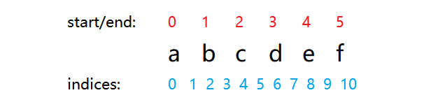

边界情况：

- 示例1. 
输入: "a" 
输出: "a"  
- 示例2. 
输入: "abc" 
输出: "a"  
- 示例3. 
输入: "" 
输出: ""  
- 示例4. 
输入: "ccc" 
输出: "ccc"

### 1.我的解(超时)
一开始想出来的就是蛮力法，暴力查找。即先写一个判断是否为回文的函数，然后遍历字符串 `s`中所有可能子串，判断其是否为回文，然后返回最长的。  
这种方法易于实现，也容易理解，就是太耗时了，虽然是对的但最终没有通过测试！  
[源码点击](m1.py)
### 2.查找后的解(1164ms)
按照阅读解答中的提示，采用了[方法四（中心扩展法）](https://leetcode-cn.com/problems/longest-palindromic-substring/solution/)来实现：
  

如图所示，其思路为分别以 `indices`中的各个值为中心，然后向两边扩展子串。当以`indices`中的每个值为中心时，首先要计算的就是原始字符串中的起始索引`start`和结尾索引`end`；当`s[start]!=s[end]`时，就判断当前回文子串的长度`len(s[start+1:end])`，然后做出相应的判断。

[源码点击](m2.py)

### 3.最优解(72ms)

