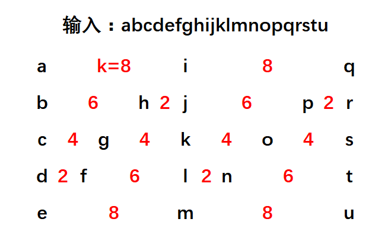

边界情况： 
输入：`s = '',numRow=1` 
输出： `''`

输入：`s = 'A',numRow=1` 
输出： `A`

输入：`s = 'AB',numRow=1` 
输出： `AB`

输入：`s = 'AB',numRow=2` 
输出： `AB`

### 解：
如图所示：

第一步：求索引，红色数字为左右两个字符之间间隔 `space`，且为第0行或者第`numRaw-1`行时，`space=k`;其余情况时当前字符的索引加上space即为下一个字符的索引； 
第二步：按索引遍历一次；

